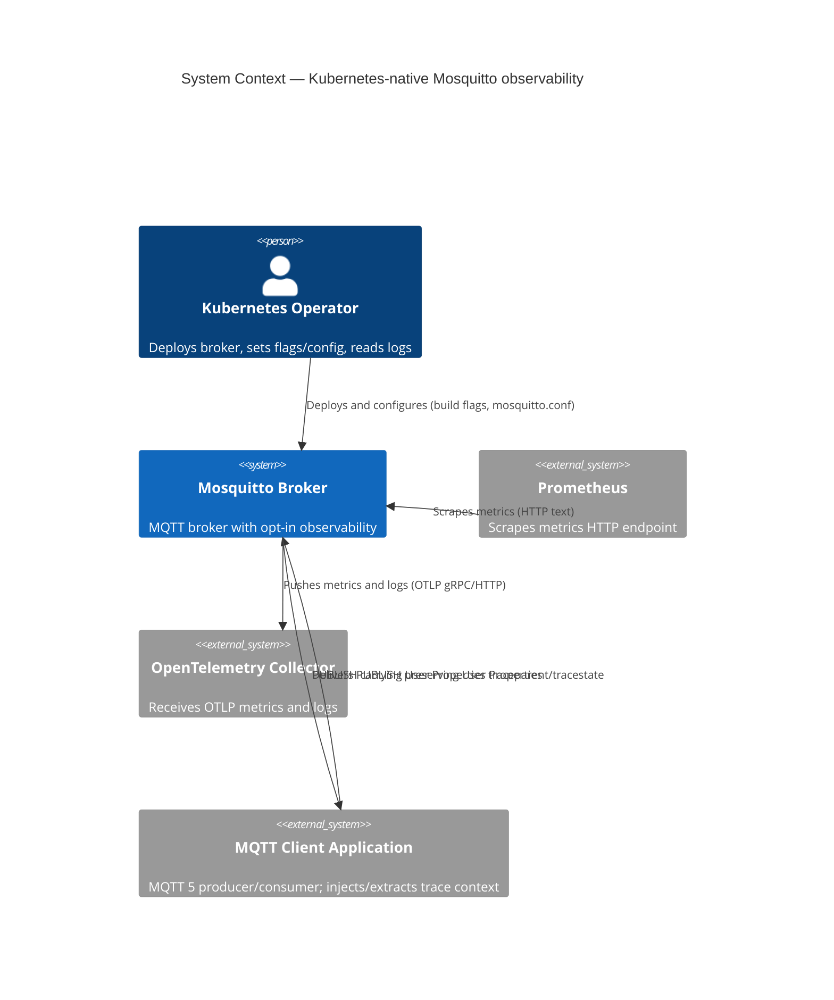

# Kubernetes-native Mosquitto observability — Specification

Feature slug: `kubernetes-native` · Session ticket: [#2](https://github.com/michal-michaluk/ai-legacy-be-c/issues/2) · Backlog: [#1](https://github.com/michal-michaluk/ai-legacy-be-c/issues/1)

> **Status:** §1–§3 accepted and landed. §4 elements tracked as issues **#3–#8**. §5 pending
> element-by-element design. Evidence files: [`findings-*.md`](.) in this directory.

## Registers

| ID | Type | Statement | Status |
|---|---|---|---|
| F1 | Finding | `$SYS` metrics live entirely in `mosquitto/src/sys_tree.c:54-142`; retained/QoS2; gated by `WITH_SYS_TREE` (default on) + `sys_interval` (default 10 s) | accepted |
| F2 | Finding | MQTT 5 User Properties are parsed (`lib/property_mosq.c:144`), kept (`src/property_broker.c:155-158`) and re-serialized (`lib/send_publish.c:319`) generically; broker reads no user-property key today | accepted |
| F3 | Finding | No tracing/OTel code exists anywhere; the broker creates no spans (greenfield) | accepted |
| F4 | Finding | Logging has one choke point `log__vprintf` (`src/logging.c:234`) but ~636 human-formatted call sites across 50 files | accepted |
| F5 | Finding | Build options follow `config.mk` + CMake `option_env`; `WITH_HTTP_API` (`src/CMakeLists.txt:95,148-166`) is the closest "optional HTTP endpoint" pattern | accepted |
| F6 | Finding | `docs/arch/*` guides referenced by `AGENTS.md` do not exist (`docs/` is empty) | accepted |
| F7 | Finding | MQTT 5 User Properties are forwarded **completely** on every delivery path (normal/QoS0-2/retained/persistent/will/shared/bridge-MQTT5/WS); only inherent drops: MQTT 3.1.1 has none, oversize messages dropped whole (`findings-trace-passthrough.md`) | accepted |
| F8 | Finding | HTTP server **in source** (libmicrohttpd HTTP API) but **compiled out locally** (dep not installed); **no gRPC/protobuf/OTel anywhere** (`findings-http-and-grpc.md`) | accepted |
| F9 | Finding | `opentelemetry-cpp` is stable but **C++ — "C is not a goal"**; HTTP needs protobuf+curl, gRPC adds grpc+abseil; Prometheus 0.0.4 needs no library (`findings-otlp-c-library.md`) | accepted |
| F10 | Finding | **No official OTel MQTT instrumentation exists in any language**; only experimental `aedes-otel-instrumentation` (Node.js) uses MQTT 5 User Properties; all major client libs expose them (`findings-otel-mqtt-instrumentation.md`) | accepted |
| R1 | Risk | Structured JSON needs ~636 call sites enriched, or a formatter wrapping pre-rendered strings | open |
| R2 | Risk | No ratified W3C/OTel MQTT trace mapping (`trace-context-mqtt` DISCONTINUED; no official OTel MQTT instrumentation anywhere — F10) — de-facto convention only | open |
| R3 | Risk | OTLP needs a protobuf/gRPC dependency in a C broker; offline/`deps` vendoring and build complexity | open |
| R4 | Risk | Prometheus/OTel metrics must be driven by the same source as `$SYS`, else metric drift | open |
| R5 | Risk | `$SYS` names use `/`, have aliases, re-emit only on change; Prometheus naming/type mapping needed | open |
| Q1 | Question | OTLP C library choice | **answered — see F9; implementation strategy still open (Q9)** |
| Q2 | Question | Endpoint config surface | **answered — D5** |
| Q3 | Question | Metric naming, type mapping, temporality | **answered — D6** |
| Q4 | Question | JSON log field schema + OTLP log export | **answered — D8** |
| Q5 | Question | Does C3 need code given generic User Property pass-through | **answered — no code needed (F7)** |
| Q6 | Question | OTLP metrics push configuration | **answered — D7** |
| Q7 | Question | Local test environment shape/location | **answered — D10** |
| Q8 | Question | Zero-overhead quality gate | **answered — D11** |
| Q9 | Decision | OTLP implementation strategy | **answered — (b) hand-roll OTLP/HTTP (protobuf+curl); gRPC separate flag later (D9)** |

## 1. Raw materials

| # | Source | Type | What it is | Use for | Status |
|---|---|---|---|---|---|
| 1 | [`intake-transcript.md`](intake-transcript.md) | transcript | Verbatim PL operator recording | goals, scope | fact |
| 2 | [`intake.md`](intake.md) | doc | Redacted PL version of (1) | scope | fact |
| 3 | [`intake.en.md`](intake.en.md) | doc | EN translation of (2) | scope | fact |
| 4 | [`findings-sys-metrics.md`](findings-sys-metrics.md) | findings | Current `$SYS` metric inventory (Q1) | metrics design | fact |
| 5 | [`findings-build-flags.md`](findings-build-flags.md) | findings | Build-flag architecture + recipe (Q5) | opt-in design | fact |
| 6 | [`findings-mqtt5-user-properties.md`](findings-mqtt5-user-properties.md) | findings | User-property parse/store/forward sites (Q4) | tracing design | fact |
| 7 | [`findings-logging.md`](findings-logging.md) | findings | Logging choke point + call-site count (Q6) | logging design | fact |
| 9 | [`findings-trace-passthrough.md`](findings-trace-passthrough.md) | findings | User Property pass-through across all delivery paths (Q5) | tracing design | fact |
| 10 | [`findings-http-and-grpc.md`](findings-http-and-grpc.md) | findings | HTTP-server/gRPC presence in current code | endpoint design | fact |
| 11 | [`findings-otlp-c-library.md`](findings-otlp-c-library.md) | findings | OTLP C-library options + protocol/licensing (Q1) | exporter design | fact |
| 12 | [`findings-otel-mqtt-instrumentation.md`](findings-otel-mqtt-instrumentation.md) | findings | OTel MQTT instrumentation landscape (D2) | tracing design | fact |

**Feature topics (intake):** (1) Prometheus metrics endpoint · (2) OTel trace-context propagation ·
(3) OTel metrics · (4) compile-time opt-in flags · (5) structured JSON logging.

**Operator decisions recorded at intake:**
- Q1 — enumerate the current `$SYS` system topics in the spec (→ section 3 / `findings-sys-metrics.md`).
- Q2 — target latest/current standard versions and the most common HTTP path; in-cluster needs no auth/TLS; secure/external exposure is **deferred**.
- Q3 — OTLP **gRPC** and **HTTP** are **independent** feature flags.
- Q4 — broker only **carries** trace context (no spans); follow the Kafka/messaging convention.
- Q5 — new flags in the style of current flags (→ `findings-build-flags.md`).
- Q6 — use the OTel standard for logs.
- Q7 — no Kubernetes artifacts under `mosquitto/`; provide a **local test environment** + documentation.
- Q8 — track with tickets **and** spec files.

## 2. Goals, actors, capabilities, properties

- **We build:** compile-time opt-in observability for the Mosquitto broker.
- **For whom:** Kubernetes operators (platform/SRE) and MQTT application developers.
- **Because:** make the broker deployable and operable with standard Kubernetes observability tooling.
- **Success looks like:** metrics, trace context and logs usable by Prometheus/OTel with the default deployment unchanged.
- **Capabilities:**
  - **C1 Prometheus metrics** — expose the existing `$SYS` metric set in Prometheus text format over HTTP.
  - **C2 OTel metrics** — expose the same metric set over OTLP; gRPC and HTTP transports independently selectable.
  - **C3 Trace propagation** — carry W3C `traceparent`/`tracestate` in MQTT 5 User Properties, transparently; broker creates no spans. (MQTT 5 User Property forwarding already exists generically — F2 — so the carry may require no new data path; see D4/Q5.)
  - **C4 Opt-in build** — each capability behind its own compile-time flag, default off, freely combinable.
  - **C5 Structured JSON logging** — emit broker logs as structured JSON (OTel-aligned schema).
- **Properties:** zero overhead + identical deployment when flags off · metric set identical to `$SYS` (nothing more) · flags independent · public C API/ABI unchanged · in-cluster HTTP/OTLP without auth/TLS (secure/external exposure deferred) · local test environment + operator docs.

**Assumptions (accepted):**
- **A1** — metric set = currently **emitted** `$SYS` topics only: numeric metrics + `version`/`uptime` + 27 load-rate topics. **Excludes** `$SYS/broker/log/*` (logs) and `$SYS/broker/connection/*/state` (bridge liveness, non-numeric).
- **A2** — OTel output = OTLP **push for metrics**; logs = **JSON to stdout** with **optional OTLP log export** under the same flag.
- **A3** — trace propagation is **MQTT 5 only**.

**Accepted capability design (C1–C5):**

| ID | Decision |
|---|---|
| C1 | Native HTTP endpoint, **pull/scrape** model, `GET /metrics`, Prometheus text exposition **0.0.4**, configurable port; serves **current** values on every scrape (independent of `$SYS` change-only publishing) |
| C2 | **Push** via OTLP to a collector; **gRPC and HTTP behind independent flags**; same metric set as C1; configurable export interval |
| C3 | Transparent carry only, no spans, no rewrite, MQTT 5 only; **no new data path if generic pass-through suffices** (Q5) |
| C4 | Flags `WITH_PROMETHEUS`, `WITH_OTEL_METRICS_GRPC`, `WITH_OTEL_METRICS_HTTP`, `WITH_JSON_LOGGING`; **default OFF**, independent, combinable. **No trace flag** — C3 needs no code (Q5/F7) |
| C5 | Single flag `WITH_JSON_LOGGING`; structured JSON emitted at the `log__vprintf` choke point; stdout/file destinations retained; OTel-aligned fields |

**Accepted design decisions (D1–D4)** — Kafka/messaging model (see
[`findings-otel-trace-research.md`](findings-otel-trace-research.md#broker-side-spans-dedicated-research)):
- **D1** — Broker is a **transparent trace-context carrier**: forwards `traceparent`/`tracestate` unchanged, **creates no spans**.
- **D2** — **Tracing is a client responsibility**: producer creates/attaches context, broker carries, consumers extract (mirrors Kafka).
- **D3** — Broker **exposes metrics via native endpoints** (C1/C2); intentional, accepted deviation from Kafka's JMX + external exporter.
- **D4** — No broker-added spans, no rewriting; if generic MQTT 5 User Property forwarding transports the context (F2), C3 is **documentation + conformance test** rather than a new data path.

**Accepted element-level decisions (D5–D11, from Q2/Q3/Q4/Q6/Q7/Q8/Q9):**
- **D5 (endpoints)** — Prometheus via a new listener `protocol prometheus` (served by libmicrohttpd, same infra as HTTP API) exposing `GET /metrics`; OTLP via global config options `otlp_endpoint` and `otlp_export_interval`.
- **D6 (naming/types)** — map `$SYS/…` → `mosquitto_*` (`/`→`_`, drop leading `$`): e.g. `$SYS/broker/messages/received` → `mosquitto_broker_messages_received`; **counters** for cumulative metrics, **gauges** for sampled; OTel temporality **cumulative**; exact 1:1 with the emitted set (A1).
- **D7 (OTLP push)** — `otlp_endpoint` (default `http://localhost:4318` HTTP, `:4317` gRPC), `otlp_export_interval` (default 60 s), `otlp_headers`, resource attributes `service.name=mosquitto`, `service.version`, `service.instance.id`.
- **D8 (JSON logs)** — OTel Logs data model fields (`Timestamp`, `SeverityText`, `Body`, `Attributes`, `Resource`); one JSON object per line to stdout; OTLP log export when an endpoint is configured.
- **D9 (OTLP implementation)** — hand-roll OTLP/HTTP with `protobuf`+`curl`; gRPC as a separate flag added later. Avoids pulling C++/grpc/abseil for the common case (F9).
- **D10 (test env)** — compose/k3s environment at the **repo root** (not `mosquitto/`): broker (built with flags) + otel-collector + Prometheus + Grafana + MQTT client + runbook.
- **D11 (zero-overhead gate)** — build both configs; with flags off assert: no new symbols/deps, byte-identical `$SYS` output, existing tests pass, no new config keys accepted.

### C4 Context

## 3. What we already have

| Area (Step-2 capability) | Status | Where | Reuse |
|---|---|---|---|
| C1 Prometheus metrics | missing endpoint; metrics exist | `mosquitto/src/sys_tree.c:54-142`, `src/http_api.c:242-260` | extend — drive from the same `$SYS` source |
| C2 OTel metrics (OTLP) | missing | — | build new |
| C3 Trace propagation | **no code needed**; generic User Properties already pass through completely (F7) | `lib/property_mosq.c:144`, `src/property_broker.c:144-174`, `lib/send_publish.c:317-333`, `src/persist_write_v5.c:150-190` | documentation + conformance test |
| C4 Opt-in build flags | flag infrastructure exists | `config.mk`, `CMakeLists.txt:43-48`, `src/CMakeLists.txt:95,148-166` | extend — add new flags |
| C5 Structured JSON logging | missing; centralised but human-formatted | `src/logging.c:234` (+ ~636 call sites) | extend — formatter at choke point |
| Existing HTTP endpoint pattern | exists fully | `src/http_api.c`, `src/listeners.c:207-329`, `src/conf.c:2456-2462` | reuse as-is for the metrics endpoint |
| Operator docs / local test env | missing | `docs/` empty (`AGENTS.md` refs dangling) | build new |

## 4. Key elements

Each element is tracked as a child issue of [#1](https://github.com/michal-michaluk/ai-legacy-be-c/issues/1):

| # | Element | Type | Issue |
|---|---|---|---|
| 5.1 | Prometheus metrics HTTP endpoint | new external API we expose | [#3](https://github.com/michal-michaluk/ai-legacy-be-c/issues/3) |
| 5.2 | OTLP metrics exporter (gRPC / HTTP) | new external API we expose | [#4](https://github.com/michal-michaluk/ai-legacy-be-c/issues/4) |
| 5.3 | Trace-context convention (docs + conformance test) | documentation / test | [#5](https://github.com/michal-michaluk/ai-legacy-be-c/issues/5) |
| 5.4 | Opt-in compile-time flags | build surface | [#6](https://github.com/michal-michaluk/ai-legacy-be-c/issues/6) |
| 5.5 | Structured JSON logging | technical concept | [#7](https://github.com/michal-michaluk/ai-legacy-be-c/issues/7) |
| 5.6 | Local test environment + operator documentation | supporting deliverable | [#8](https://github.com/michal-michaluk/ai-legacy-be-c/issues/8) |

## 5. Element specifications (pending)

To be produced one element at a time per Step 5.

## Scope

### In scope
- C1–C5 observability capabilities for the Mosquitto broker.
- Compile-time flags: independent, default off, combinable (OTel gRPC × OTel HTTP × Prometheus × tracing × JSON logging).
- Metric set identical to the currently emitted `$SYS` set (nothing more).
- In-cluster HTTP/OTLP endpoints without auth/TLS.
- Local test environment and operator documentation (outside `mosquitto/`).

### Deferred
- Authentication/TLS for Prometheus and OTLP endpoints (external/secure exposure).

### Out of scope
- Broker-created spans (C3 carries context only).
- MQTT 3.1.1 trace propagation (no metadata channel).
- Kubernetes deployment artifacts (Helm chart, ServiceMonitor) under `mosquitto/`.
