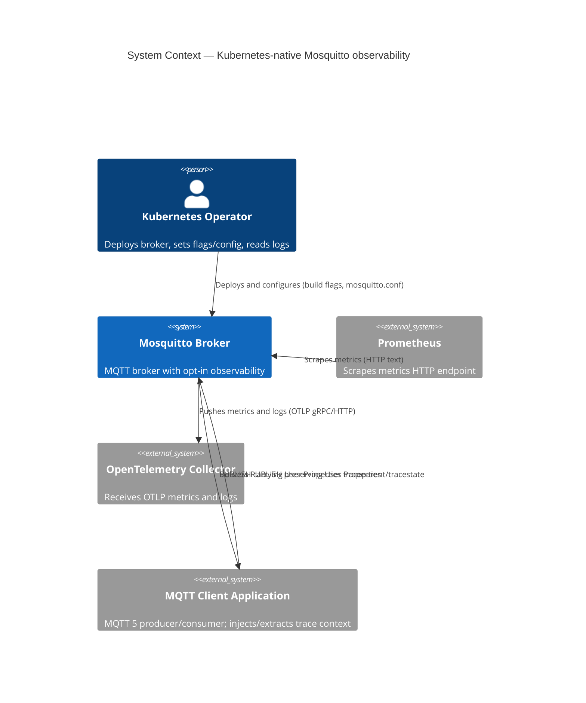

# Kubernetes-native Mosquitto observability — Specification

Feature slug: `kubernetes-native` · Session ticket: [#2](https://github.com/michal-michaluk/ai-legacy-be-c/issues/2) · Backlog: [#1](https://github.com/michal-michaluk/ai-legacy-be-c/issues/1)

> **Status:** §1–§3 accepted and landed. §4 elements tracked as issues **#3–#8**. §5 pending
> element-by-element design. Evidence files: [`findings-*.md`](.) in this directory.

## Registers

| ID | Type | Statement | Status |
|---|---|---|---|
| F1 | Finding | `$SYS` metrics live entirely in `mosquitto/src/sys_tree.c:54-142`; retained/QoS2; gated by `WITH_SYS_TREE` (default on) + `sys_interval` (default 10 s) | accepted |
| F2 | Finding | MQTT 5 User Properties are parsed (`lib/property_mosq.c:144`), kept (`src/property_broker.c:155-158`) and re-serialized (`lib/send_publish.c:319`) generically; broker reads no user-property key today | accepted |
| F3 | Finding | No tracing/OTel code exists anywhere; the broker creates no spans (greenfield) | accepted |
| F4 | Finding | Logging has one choke point `log__vprintf` (`src/logging.c:234`) but ~636 human-formatted call sites across 50 files | accepted |
| F5 | Finding | Build options follow `config.mk` + CMake `option_env`; `WITH_HTTP_API` (`src/CMakeLists.txt:95,148-166`) is the closest "optional HTTP endpoint" pattern | accepted |
| F6 | Finding | **Corrected:** `docs/arch/*.md` (14 files) and `docs/test/*.md` (3) **do exist** — the `AGENTS.md` references are valid; an earlier note claiming `docs/` was empty was wrong. `docs/arch/feature-flags.md` already prescribes the `WITH_*` recipe for C4 | accepted |
| F7 | Finding | MQTT 5 User Properties are forwarded **completely** on every delivery path (normal/QoS0-2/retained/persistent/will/shared/bridge-MQTT5/WS); only inherent drops: MQTT 3.1.1 has none, oversize messages dropped whole (`findings-trace-passthrough.md`) | accepted |
| F8 | Finding | HTTP server **in source** (libmicrohttpd HTTP API) but **compiled out locally** (dep not installed); **no gRPC/protobuf/OTel anywhere** (`findings-http-and-grpc.md`) | accepted |
| F9 | Finding | `opentelemetry-cpp` is stable but **C++ — "C is not a goal"**; HTTP needs protobuf+curl, gRPC adds grpc+abseil; Prometheus 0.0.4 needs no library (`findings-otlp-c-library.md`) | accepted |
| F10 | Finding | **No official OTel MQTT instrumentation exists in any language**; only experimental `aedes-otel-instrumentation` (Node.js) uses MQTT 5 User Properties; all major client libs expose them (`findings-otel-mqtt-instrumentation.md`) | accepted |
| F11 | Finding | Local verification harness = **`otel/opentelemetry-collector-contrib`** (OTLP receiver + local JSONL file storage); Kubernetes deployment target = **local k3s** | accepted |
| F12 | Finding | OTLP/HTTP **JSON** encoding is spec-defined and accepted by the collector's `otlp` receiver (`application/json`, `POST /v1/metrics`, port 4318); the receiver lives in the **core** collector repo (bundled in the contrib image); enums are encoded as integers and 64-bit ints as decimal strings — so **no protobuf library** is needed | accepted |
| R1 | Risk | Structured JSON needs ~636 call sites enriched, or a formatter wrapping pre-rendered strings | open |
| R2 | Risk | No ratified W3C/OTel MQTT trace mapping (`trace-context-mqtt` DISCONTINUED; no official OTel MQTT instrumentation anywhere — F10) — de-facto convention only | open |
| R3 | Risk | OTLP needs a protobuf/gRPC dependency in a C broker; offline/`deps` vendoring and build complexity | open |
| R4 | Risk | Prometheus/OTel metrics must be driven by the same source as `$SYS`, else metric drift | open |
| R5 | Risk | `$SYS` names use `/`, have aliases, re-emit only on change; Prometheus naming/type mapping needed | open |
| Q1 | Question | OTLP C library choice | **answered — see F9; implementation strategy still open (Q9)** |
| Q2 | Question | Endpoint config surface | **answered — D5** |
| Q3 | Question | Metric naming, type mapping, temporality | **answered — D6** |
| Q4 | Question | JSON log field schema + OTLP log export | **answered — D8** |
| Q5 | Question | Does C3 need code given generic User Property pass-through | **answered — no code needed (F7)** |
| Q6 | Question | OTLP metrics push configuration | **answered — D7** |
| Q7 | Question | Local test environment shape/location | **answered — D10** |
| Q8 | Question | Zero-overhead quality gate | **answered — D11** |
| Q9 | Decision | OTLP implementation strategy | **answered — (b′) hand-emit OTLP/HTTP JSON (libcurl+libcjson); no protobuf, no gRPC (D9)** |

## 1. Raw materials

| # | Source | Type | What it is | Use for | Status |
|---|---|---|---|---|---|
| 1 | [`intake-transcript.md`](intake-transcript.md) | transcript | Verbatim PL operator recording | goals, scope | fact |
| 2 | [`intake.md`](intake.md) | doc | Redacted PL version of (1) | scope | fact |
| 3 | [`intake.en.md`](intake.en.md) | doc | EN translation of (2) | scope | fact |
| 4 | [`findings-sys-metrics.md`](findings-sys-metrics.md) | findings | Current `$SYS` metric inventory (Q1) | metrics design | fact |
| 5 | [`findings-build-flags.md`](findings-build-flags.md) | findings | Build-flag architecture + recipe (Q5) | opt-in design | fact |
| 6 | [`findings-mqtt5-user-properties.md`](findings-mqtt5-user-properties.md) | findings | User-property parse/store/forward sites (Q4) | tracing design | fact |
| 7 | [`findings-logging.md`](findings-logging.md) | findings | Logging choke point + call-site count (Q6) | logging design | fact |
| 9 | [`findings-trace-passthrough.md`](findings-trace-passthrough.md) | findings | User Property pass-through across all delivery paths (Q5) | tracing design | fact |
| 10 | [`findings-http-and-grpc.md`](findings-http-and-grpc.md) | findings | HTTP-server/gRPC presence in current code | endpoint design | fact |
| 11 | [`findings-otlp-c-library.md`](findings-otlp-c-library.md) | findings | OTLP C-library options + protocol/licensing (Q1) | exporter design | fact |
| 12 | [`findings-otel-mqtt-instrumentation.md`](findings-otel-mqtt-instrumentation.md) | findings | OTel MQTT instrumentation landscape (D2) | tracing design | fact |

**Feature topics (intake):** (1) Prometheus metrics endpoint · (2) OTel trace-context propagation ·
(3) OTel metrics · (4) compile-time opt-in flags · (5) structured JSON logging.

**Operator decisions recorded at intake:**
- Q1 — enumerate the current `$SYS` system topics in the spec (→ section 3 / `findings-sys-metrics.md`).
- Q2 — target latest/current standard versions and the most common HTTP path; in-cluster needs no auth/TLS; secure/external exposure is **deferred**.
- Q3 — OTLP **gRPC** and **HTTP** are **independent** feature flags.
- Q4 — broker only **carries** trace context (no spans); follow the Kafka/messaging convention.
- Q5 — new flags in the style of current flags (→ `findings-build-flags.md`).
- Q6 — use the OTel standard for logs.
- Q7 — no Kubernetes artifacts under `mosquitto/`; provide a **local test environment** + documentation.
- Q8 — track with tickets **and** spec files.

## 2. Goals, actors, capabilities, properties

- **We build:** compile-time opt-in observability for the Mosquitto broker.
- **For whom:** Kubernetes operators (platform/SRE) and MQTT application developers.
- **Because:** make the broker deployable and operable with standard Kubernetes observability tooling.
- **Success looks like:** metrics, trace context and logs usable by Prometheus/OTel with the default deployment unchanged.
- **Capabilities:**
  - **C1 Prometheus metrics** — expose the existing `$SYS` metric set in Prometheus text format over HTTP.
  - **C2 OTel metrics** — expose the same metric set over OTLP; gRPC and HTTP transports independently selectable.
  - **C3 Trace propagation** — carry W3C `traceparent`/`tracestate` in MQTT 5 User Properties, transparently; broker creates no spans. (MQTT 5 User Property forwarding already exists generically — F2 — so the carry may require no new data path; see D4/Q5.)
  - **C4 Opt-in build** — each capability behind its own compile-time flag, default off, freely combinable.
  - **C5 Structured JSON logging** — emit broker logs as structured JSON (OTel-aligned schema).
- **Properties:** zero overhead + identical deployment when flags off · metric set identical to `$SYS` (nothing more) · flags independent · public C API/ABI unchanged · in-cluster HTTP/OTLP without auth/TLS (secure/external exposure deferred) · local test environment + operator docs.

**Assumptions (accepted):**
- **A1** — metric set = currently **emitted** `$SYS` topics only: numeric metrics + `version`/`uptime` + 27 load-rate topics. **Excludes** `$SYS/broker/log/*` (logs) and `$SYS/broker/connection/*/state` (bridge liveness, non-numeric).
- **A2** — OTel output = OTLP **push for metrics**; logs = **JSON to stdout** with **optional OTLP log export** gated by `WITH_OTEL`.
- **A3** — trace propagation is **MQTT 5 only**.

**Accepted capability design (C1–C5):**

| ID | Decision |
|---|---|
| C1 | Native HTTP endpoint, **pull/scrape** model, `GET /metrics`, Prometheus text exposition **0.0.4**, configurable port; serves **current** values on every scrape (independent of `$SYS` change-only publishing) |
| C2 | **Push** via OTLP/**HTTP JSON** to a collector; gated by the single `WITH_OTEL` flag; same metric set as C1; configurable export interval |
| C3 | Transparent carry only, no spans, no rewrite, MQTT 5 only; **no new data path if generic pass-through suffices** (Q5) |
| C4 | Flags `WITH_PROMETHEUS`, `WITH_OTEL`, `WITH_JSON_LOGGING`; **default OFF**, independent, combinable. **A single `WITH_OTEL` flag covers the entire OpenTelemetry capability** — metrics export today; gRPC transport and OTLP log export land under this same flag, never as per-transport flags. **No trace flag** — C3 needs no code (Q5/F7) |
| C5 | Single flag `WITH_JSON_LOGGING`; structured JSON emitted at the `log__vprintf` choke point; stdout/file destinations retained; OTel-aligned fields. Any **OTLP log export** belongs to the `WITH_OTEL` capability, not this flag |

**Accepted design decisions (D1–D4)** — Kafka/messaging model (see
[`findings-otel-trace-research.md`](findings-otel-trace-research.md#broker-side-spans-dedicated-research)):
- **D1** — Broker is a **transparent trace-context carrier**: forwards `traceparent`/`tracestate` unchanged, **creates no spans**.
- **D2** — **Tracing is a client responsibility**: producer creates/attaches context, broker carries, consumers extract (mirrors Kafka).
- **D3** — Broker **exposes metrics via native endpoints** (C1/C2); intentional, accepted deviation from Kafka's JMX + external exporter.
- **D4** — No broker-added spans, no rewriting; if generic MQTT 5 User Property forwarding transports the context (F2), C3 is **documentation + conformance test** rather than a new data path.

**Accepted element-level decisions (D5–D11, from Q2/Q3/Q4/Q6/Q7/Q8/Q9):**
- **D5 (endpoints)** — Prometheus via a new listener `protocol prometheus` (served by libmicrohttpd, same infra as HTTP API) exposing `GET /metrics`; OTLP via global config options `otlp_endpoint` and `otlp_export_interval`.
- **D6 (naming/types)** — map `$SYS/…` → `mosquitto_*` (`/`→`_`, drop leading `$`): e.g. `$SYS/broker/messages/received` → `mosquitto_broker_messages_received`; **counters** for cumulative metrics, **gauges** for sampled; OTel temporality **cumulative**; exact 1:1 with the emitted set (A1).
- **D7 (OTLP push)** — `otlp_endpoint` (default `http://localhost:4318` HTTP, `:4317` gRPC), `otlp_export_interval` (default 60 s), `otlp_headers`, resource attributes `service.name=mosquitto`, `service.version`, `service.instance.id`.
- **D8 (JSON logs)** — OTel Logs data model fields (`Timestamp`, `SeverityText`, `Body`, `Attributes`, `Resource`); one JSON object per line to stdout; OTLP log export when an endpoint is configured.
- **D9 (OTLP implementation)** — hand-emit **OTLP/HTTP JSON** with `libcurl`+`libcjson`; **no protobuf, no gRPC/abseil**. gRPC is **out of scope** (excluded at clarification). Avoids pulling C++/protobuf/grpc/abseil into the C broker (F9/F12).
- **D10 (test env)** — environment at the **repo root** (not `mosquitto/`): broker (built with flags) + **`otel/opentelemetry-collector-contrib`** (OTLP receiver, local JSONL file storage) + Prometheus + Grafana + MQTT client + runbook. Kubernetes target = **local k3s**.
- **D12 (proof harness)** — quality gates are proven **locally** against the user's `otel/opentelemetry-collector-contrib` (assert on its JSONL output); the same gates apply when deployed to **local k3s**. See §6.
- **D11 (zero-overhead gate)** — build both configs; with flags off assert: no new symbols/deps, byte-identical `$SYS` output, existing tests pass, no new config keys accepted.
- **D13 (metric type rule)** — the OTel type is decided by a **deterministic enum→(type, monotonic, unit) table**, never by a metric's runtime behaviour: on-event monotonic counters (`messages/bytes/*`, `publish/*`, `connections/socket/count`, `clients/expired`) → `Sum` monotonic=true; peak metrics (`clients/maximum`, `heap/maximum`) → `Gauge`; every other sampled metric and all load rates → `Gauge`; `uptime` → `Sum` monotonic=true, unit `s`. The whole table is pinned 1:1 to A1 by a unit test.

### C4 Context



## 3. What we already have

| Area (Step-2 capability) | Status | Where | Reuse |
|---|---|---|---|
| C1 Prometheus metrics | missing endpoint; metrics exist | `mosquitto/src/sys_tree.c:54-142`, `src/http_api.c:242-260` | extend — drive from the same `$SYS` source |
| C2 OTel metrics (OTLP) | missing | — | build new |
| C3 Trace propagation | **no code needed**; generic User Properties already pass through completely (F7) | `lib/property_mosq.c:144`, `src/property_broker.c:144-174`, `lib/send_publish.c:317-333`, `src/persist_write_v5.c:150-190` | documentation + conformance test |
| C4 Opt-in build flags | flag infrastructure exists | `config.mk`, `CMakeLists.txt:43-48`, `src/CMakeLists.txt:95,148-166` | extend — add new flags |
| C5 Structured JSON logging | missing; centralised but human-formatted | `src/logging.c:234` (+ ~636 call sites) | extend — formatter at choke point |
| Existing HTTP endpoint pattern | exists fully | `src/http_api.c`, `src/listeners.c:207-329`, `src/conf.c:2456-2462` | reuse as-is for the metrics endpoint |
| Architecture/test guides (`docs/arch`, `docs/test`) | **exist** | `docs/arch/*.md`, `docs/test/*.md` | reuse as patterns (e.g. `feature-flags.md` for C4) |
| Local test env + operator docs | missing | — | build new (otel-contrib collector + local k3s) |

## 4. Key elements

Each element is tracked as a child issue of [#1](https://github.com/michal-michaluk/ai-legacy-be-c/issues/1):

| # | Element | Type | Issue |
|---|---|---|---|
| 5.1 | Prometheus metrics HTTP endpoint | new external API we expose | [#3](https://github.com/michal-michaluk/ai-legacy-be-c/issues/3) |
| 5.2 | OTLP metrics exporter (gRPC / HTTP) | new external API we expose | [#4](https://github.com/michal-michaluk/ai-legacy-be-c/issues/4) |
| 5.3 | Trace-context convention (docs + conformance test) | documentation / test | [#5](https://github.com/michal-michaluk/ai-legacy-be-c/issues/5) |
| 5.4 | Opt-in compile-time flags | build surface | [#6](https://github.com/michal-michaluk/ai-legacy-be-c/issues/6) |
| 5.5 | Structured JSON logging | technical concept | [#7](https://github.com/michal-michaluk/ai-legacy-be-c/issues/7) |
| 5.6 | Local test environment + operator documentation | supporting deliverable | [#8](https://github.com/michal-michaluk/ai-legacy-be-c/issues/8) |

## 5. Element specifications

### 5.2 OTLP metrics exporter — existing external API we consume

**Transport in scope:** OTLP/**HTTP only**; **gRPC is out of scope** (excluded at clarification).
Encoding: **OTLP/HTTP JSON** (`application/json`) via **libcurl + libcjson** — **no protobuf
dependency** (`protobuf-c`, C++ `libprotobuf`, gRPC/abseil all rejected/out) (F12).
A single **`WITH_OTEL`** flag covers the entire OpenTelemetry capability; no per-transport flag is ever defined.

#### Contract we call

| Aspect | Value |
|---|---|
| Method / path | `POST {otlp_endpoint}/v1/metrics` |
| Content-Type / Accept | `application/json` |
| Body | JSON-encoded `ExportMetricsServiceRequest` (OTLP/JSON: lowerCamelCase keys, enums as integers, 64-bit ints as decimal strings) |
| Auth | none (in-cluster); extra headers via `otlp_headers` |
| Response consumed | `200` + JSON `ExportMetricsServiceResponse`; only `partialSuccess.rejectedDataPoints` + `errorMessage` |
| Default endpoint / port | `http://localhost:4318` (OTLP/HTTP JSON) |

#### Config (new `mosquitto.conf` options)

```conf
otlp_endpoint          http://localhost:4318   # scheme http/https; /v1/metrics appended
otlp_export_interval   60                       # seconds, default 60
otlp_headers           authorization=Bearer ... # repeatable key=value
otlp_timeout           10                       # seconds
```

#### Data model

| Element | Value |
|---|---|
| Resource attributes | `service.name=mosquitto`, `service.version=<broker version>`, `service.instance.id=<broker id>` |
| Scope | name `mosquitto`, version `<broker version>` |
| Metric set | **identical to C1** (A1) — numeric `$SYS` metrics + load rates |
| Types | `Sum` monotonic=true for counters; `Gauge` for sampled metrics and load rates |
| Temporality | cumulative; `start_time_unix_nano` = broker start |
| `$SYS/broker/version` (string) | **not** a metric → exported as resource attribute `service.version` |
| Attributes per point | none (metric name only) |

#### Sequencing & failure mapping

- **Dedicated export thread** (flag-gated): export never blocks the broker event loop; each tick snapshots current values.
- No queueing/backpressure: a failed batch is dropped, never retried out of band.

| Provider outcome | Our behaviour |
|---|---|
| `200`, `rejected=0` | ok |
| `200`, `rejected>0` | log partial-success warning |
| `4xx` | **permanent** — drop batch + error log |
| `5xx` | **transient** — drop batch, retry next interval |
| timeout / connect error | **transient** — drop batch, retry next interval |

#### Acceptance golden

An otel-collector with an `otlp` HTTP receiver receives metrics containing
`mosquitto_broker_messages_received` etc.; a stopped collector does **not** stall the broker.

### 5.1 / 5.3–5.6 — pending

To be produced one element at a time per Step 5.

## 6. Verification & quality gates

**Harness (local, D12):** gates are proven **locally** against **`otel/opentelemetry-collector-contrib`**
(OTLP receiver + JSONL file storage) — assertions parse its JSONL output. Kubernetes deployment target
is **local k3s**, with the same gates. Every gate is a **CTest-registered test** or a scripted check
(deterministic, rerunnable).

### C4 — opt-in flags

**Implemented when:** each flag exists in `config.mk` + CMake `option_env` (top-level), default OFF, in the
`WITH_HTTP_API` / `docs/arch/feature-flags.md` style; guarded `#ifdef`; valid **disabled** build; capability
reported via `report_features()`; no flag for an unimplemented feature.

| Gate | Method |
|---|---|
| G-C4.1 build matrix | build `{none, prometheus, otel_http, json_logging, all}` (CMake **and** make) — all compile clean |
| G-C4.2 zero-overhead | all-OFF binary vs baseline: `nm`/`otool -L` symbol+dependency diff **empty** |
| G-C4.3 no-regression | existing CTest suite green in every combo |
| G-C4.4 capability report | `report_features()` matches the configured set |

### C3 — trace-context propagation (carry only)

**Implemented when:** convention documented (`traceparent`/`tracestate` as MQTT 5 User Properties, R2);
conformance test proves carry-through. **No broker code** (F7).

| Gate | Method |
|---|---|
| G-C3.1 happy | MQTT 5 subscriber receives `traceparent`/`tracestate` **byte-identical** |
| G-C3.2 paths | same across QoS 0/1/2, retained, persistent-across-restart, will, shared sub, WebSocket, bridge-MQTT5 |
| G-C3.3 negative | MQTT 3.1.1 subscriber receives **no** properties |
| G-C3.4 oversize | subscriber `maximum_packet_size` exceeded → whole message dropped (documented), not property-specific |
| G-C3.5 regression | suite fails if core ever mutates/strips user properties |

### C2 — OTLP metrics exporter (HTTP now · gRPC deferred)

**Implemented when:** flag on → periodic OTLP/HTTP JSON `POST /v1/metrics` with the C1 metric set,
correct types/temporality + resource attrs; flag off → no code, no thread (§5.2).
*(out of scope)* gRPC / protobuf transport.

| Gate | Method |
|---|---|
| G-C2.1 delivery | collector (`otel/opentelemetry-collector-contrib`, OTLP HTTP receiver) → assert JSONL contains `mosquitto_broker_messages_received` etc. with type/temporality + resource attrs |
| G-C2.2 payload | parse captured JSON `ExportMetricsServiceRequest`; assert set/values (golden) |
| G-C2.3 non-blocking | collector **hung** → broker latency/throughput within budget; no event-loop stall |
| G-C2.4 transient | collector down/5xx → batch dropped, warning logged, **recovers** when collector returns |
| G-C2.5 permanent | 4xx → error logged, no retry storm |
| G-C2.6 zero-overhead | flag off ⇒ folded into G-C4.2 |

**Resolved:** gRPC is **out of scope** now; broker-level tests live in `mosquitto/test/{broker,unit}/`
(CTest, `mosquitto/build-tests`); G-C2.3 asserts no regression vs the baseline throughput/latency.

## Scope

### In scope
- C1–C5 observability capabilities for the Mosquitto broker.
- Compile-time flags: independent, default off, combinable (`WITH_OTEL` × `WITH_PROMETHEUS` × `WITH_JSON_LOGGING`); only `WITH_OTEL` is implemented in the current plan.
- Metric set identical to the currently emitted `$SYS` set (nothing more).
- In-cluster HTTP/OTLP endpoints without auth/TLS.
- Local test environment and operator documentation (outside `mosquitto/`).

### Deferred
- Authentication/TLS for Prometheus and OTLP endpoints (external/secure exposure).

### Out of scope
- Broker-created spans (C3 carries context only).
- MQTT 3.1.1 trace propagation (no metadata channel).
- Kubernetes deployment artifacts (Helm chart, ServiceMonitor) under `mosquitto/`.
- OTLP/gRPC and protobuf transport (excluded at clarification; gRPC comes later, if at all).

---

## Implementation Plan

Planning ticket: [#11](https://github.com/michal-michaluk/ai-legacy-be-c/issues/11). Scope = the three
focus capabilities only: **C3** trace-context carry, **C2** OTLP metrics, **C4** opt-in flag. C1
(Prometheus endpoint) and C5 (JSON logging) are **not** implemented here, but C4 and the metrics
source are designed so they slot in later.

### Available Infrastructure

- **Build:** CMake + Ninja (primary; `cmake -S mosquitto -B <dir>`); legacy GNU make (`config.mk` + `make/*.mk`). Option mechanism `option_env()` (`mosquitto/CMakeLists.txt:58-77`, `mosquitto/src/CMakeLists.txt:90-100`).
- **Test:** CTest E2E harness at `mosquitto/build-tests` (`-DWITH_TESTS=ON -DWITH_BUNDLED_DEPS=ON`); scenarios in `mosquitto/test/{unit,lib,broker,client,apps}` (Python + C) per `docs/test/*.md`. Local proof harness = `otel/opentelemetry-collector-contrib` (OTLP HTTP receiver → JSONL file, D12). Scratch/build dirs under `.agents/tmp/` (gitignored).
- **Lint/format:** `semgrep` + `trivy` (security), `mosquitto/format.sh`; no enforced C linter.
- **Language:** C11. New link dependency: **libcurl** only; **libcjson already linked** (so OTLP/JSON needs no protobuf).
- **Verification skills:** `review` (complexity, tests, arch, security, backward-compatibility, spec-coverage), `review-security`, `e2e-mosquitto`, `run`, `troubleshooting`, `demo`, `mqtt-cli`.
- **Architecture docs:** `docs/arch/{feature-flags,protocol-and-endpoints,lifecycle-management,memory-management,error-handling,code-structure}.md`, `docs/test/{broker-e2e-tests,testing-and-build,unit-tests}.md`, `docs/arch/feature-flags.md` (the C4 recipe).

### Clarification Decisions

- **Q1 gRPC** → **out of scope**. Only OTLP/HTTP is implemented.
- **Q2 protobuf** → **excluded**. Use **OTLP/HTTP JSON** (`application/json`) via libcurl + libcjson (F12 proof: spec-defined, accepted by the collector's `otlp` receiver). Caveats honored: enums as integers, 64-bit ints as decimal strings.
- **Q3 flag set** → the entire OTel capability sits behind **one flag `WITH_OTEL`** (default OFF); no per-transport flags. `WITH_PROMETHEUS` / `WITH_JSON_LOGGING` are deferred to their elements (§5.1/§5.5) to satisfy G-C4.4 ("no flag for an unimplemented feature").
- **Q4 R4 metric source** → introduce a **shared current-value metric source**; C1 reuses it later. It does not change `$SYS` change-only publishing.
- **Q5 type mapping** → deterministic **enum→(type, monotonic, unit) table** (D13), pinned by a unit test; never inferred at runtime.
- **Q6 specs/tests** → the plan writes the missing `§5.3`/`§5.4` element specs; tests live in `mosquitto/test/{broker,unit}/` (CTest); the local otel-contrib JSONL output is the D12 proof harness.

### Plan (nodes with check + review)

#### Phase 1 — specs & flag scaffolding (parallel)

##### spec-elements-c3-c4
- **Goal:** write the missing element specs `§5.3` (trace-context carry convention) and `§5.4` (opt-in flag surface) and align the registers.
- **Executor:** general
- **IN / OUT:** IN `docs/specs/kubernetes-native/spec.md` (registers, C3/C4, D1–D13, §6) + `findings-trace-passthrough.md`, `findings-otel-trace-research.md`, `findings-build-flags.md`; OUT `docs/specs/kubernetes-native/spec.md` only (no code).
- **Docs:** `docs/arch/protocol-and-endpoints.md` (trace carry is protocol behaviour), `docs/arch/message-routing-and-sessions.md` (delivery paths), `docs/arch/feature-flags.md` (§5.4 flag contract).
- **check:**
  - `grep -q '^### 5.3 ' docs/specs/kubernetes-native/spec.md`
  - `grep -q '^### 5.4 ' docs/specs/kubernetes-native/spec.md`
  - `grep -qF 'WITH_OTEL' docs/specs/kubernetes-native/spec.md`
  - `! grep -qE 'WITH_OTEL_[A-Z]' docs/specs/kubernetes-native/spec.md`
- **review:** Check the new §5.3/§5.4 element specs against C3/C4, D1–D13 and §6; report every mismatch or undefined behaviour. Do not edit files — report only.

##### flag-scaffolding
- **Goal:** add the single `WITH_OTEL` build option (default OFF, whole OTel capability) across both build systems, a flag-guarded stub source, and a `report_features()` line.
- **Executor:** general
- **IN / OUT:** OUT `mosquitto/config.mk`, `mosquitto/make/broker.mk`, `mosquitto/src/Makefile`, `mosquitto/src/CMakeLists.txt`, `mosquitto/src/otel_metrics.c`, `mosquitto/src/otel_metrics.h`, `mosquitto/src/mosquitto.c`. Do NOT touch `src/conf.c`, `src/sys_tree.*`, tests (later nodes).
- **Docs:** `docs/arch/feature-flags.md` (primary recipe), `docs/arch/code-structure.md` (module placement), `docs/arch/lifecycle-management.md` (capability report at startup).
- **check:**
  - `cmake -S mosquitto -B .agents/tmp/build-otel-off -G Ninja -DCMAKE_BUILD_TYPE=Release -DWITH_BUNDLED_DEPS=ON && cmake --build .agents/tmp/build-otel-off`
  - `cmake -S mosquitto -B .agents/tmp/build-otel-on -G Ninja -DCMAKE_BUILD_TYPE=Release -DWITH_BUNDLED_DEPS=ON -DWITH_OTEL=ON && cmake --build .agents/tmp/build-otel-on`
  - `grep -qF 'WITH_OTEL' mosquitto/config.mk`
  - `grep -qF 'WITH_OTEL' mosquitto/src/CMakeLists.txt`
- **review:** Check the flag wiring against `docs/arch/feature-flags.md` and G-C4.4 (default OFF, dependency discovered only when enabled, valid disabled build, capability reported); report every gap. Do not edit files — report only.

#### Phase 2 — metrics data path (parallel, after Phase 1)

##### metrics-source
- **Goal:** a shared, flag-guarded current-value metric source (enum → current value), independent of `$SYS` change-only publishing, with no behaviour change to `$SYS`.
- **Executor:** general
- **IN / OUT:** IN `mosquitto/src/sys_tree.c/.h`, `mosquitto/src/http_api.c`; OUT `mosquitto/src/sys_tree.c`, `mosquitto/src/sys_tree.h` (the current-value accessor, declared + defined under `#ifdef WITH_OTEL`). Do NOT touch `mosquitto/src/otel_metrics.*` (owned by `otlp-payload`). No public header/API change.
- **Docs:** `docs/arch/broker-runtime.md` (loop/timers = snapshot point), `docs/arch/code-structure.md`, `docs/arch/memory-management.md` (snapshot ownership + cross-thread safety).
- **check:**
  - `cmake --build .agents/tmp/build-otel-off`
  - `cmake --build .agents/tmp/build-otel-on`
  - `cd mosquitto; make broker` (legacy make path)
  - `cmake -S mosquitto -B mosquitto/build-tests -G Ninja -DCMAKE_BUILD_TYPE=Debug -DWITH_TESTS=ON -DWITH_BUNDLED_DEPS=ON >/dev/null && cd mosquitto/build-tests && ctest -R '^broker-01-connect' --output-on-failure`
- **review:** Verify the source returns the *current* value for the full emitted set (A1) with no change to `$SYS` publishing semantics, and that all new symbols are behind the flag. Do not edit files — report only.

##### otlp-payload
- **Goal:** the deterministic enum→(metric name, type, monotonic, unit) classification table (1:1 with A1/D13) and a pure JSON encoder for `ExportMetricsServiceRequest`.
- **Executor:** general
- **IN / OUT:** IN `docs/specs/kubernetes-native/spec.md` (§5.2 data model, A1, D6, D13), `findings-sys-metrics.md`, `mosquitto/src/sys_tree.h`; OUT `mosquitto/src/otel_metrics.c`, `mosquitto/src/otel_metrics.h`, `mosquitto/test/unit/otel/**`, `mosquitto/test/unit/CMakeLists.txt`.
- **Docs:** `docs/arch/code-structure.md`, `docs/arch/error-handling.md`, `docs/arch/memory-management.md`, `docs/arch/protocol-and-endpoints.md` (separate encoding from transport).
- **check:**
  - `cmake --build .agents/tmp/build-otel-on`
  - `cmake -S mosquitto -B mosquitto/build-tests -G Ninja -DCMAKE_BUILD_TYPE=Debug -DWITH_TESTS=ON -DWITH_BUNDLED_DEPS=ON -DWITH_OTEL=ON >/dev/null && cmake --build mosquitto/build-tests && cd mosquitto/build-tests && ctest -R '^unit-.*otel' --output-on-failure`
- **review:** Check the classification table 1:1 against the emitted `$SYS` set (A1) and D13, and the JSON shape against the OTLP/JSON mapping (lowerCamelCase keys, enums as integers, 64-bit ints as decimal strings). Report every mismatch. Do not edit files — report only.

#### Phase 3 — exporter runtime (sequential, after Phase 2)

##### otlp-transport
- **Goal:** the libcurl OTLP/HTTP client, the dedicated flag-gated export thread, the `mosquitto.conf` options (`otlp_endpoint`, `otlp_export_interval`, `otlp_headers`, `otlp_timeout`), resource/scope attributes, and the §5.2 failure mapping.
- **Executor:** general
- **IN / OUT:** OUT `mosquitto/src/otel_metrics.c`, `mosquitto/src/otel_metrics.h`, `mosquitto/src/conf.c`, `mosquitto/src/mosquitto.c`, `mosquitto/src/mosquitto_broker_internal.h`, `mosquitto/test/unit/otel/**`. Do NOT change the public C API/ABI (`include/mosquitto/**`) or MQTT behaviour.
- **Docs:** `docs/arch/lifecycle-management.md` (thread start/stop/reload), `docs/arch/broker-runtime.md` (same loop), `docs/arch/error-handling.md` (failure mapping), `docs/arch/security-architecture.md` (never log `otlp_headers` values), `docs/arch/logging.md` (transient/permanent warnings), `docs/arch/memory-management.md`, `docs/arch/feature-flags.md` (runtime-gated config).
- **check:**
  - `cmake --build .agents/tmp/build-otel-off && cmake --build .agents/tmp/build-otel-on`
  - `cmake --build mosquitto/build-tests && cd mosquitto/build-tests && ctest -R '^unit-.*otel' --output-on-failure`
  - `grep -qF 'otlp_endpoint' mosquitto/src/conf.c`
  - `cd mosquitto; make broker`
- **review:** Verify the implementation against §5.2 (paths, headers, resource attrs `service.name/version/instance.id`, non-blocking dedicated thread, 4xx=permanent / 5xx+timeout=transient, no out-of-band retry) and the lifecycle rules in `docs/arch/lifecycle-management.md`. Report every gap. Do not edit files — report only.

#### Phase 4 — conformance & E2E (sequential, after Phase 3; share the test-registration files)

##### otlp-e2e
- **Goal:** E2E gates **G-C2.1–G-C2.5** with the local `otel-contrib` collector (OTLP HTTP receiver → JSONL), plus the collector harness config.
- **Executor:** general
- **IN / OUT:** OUT `mosquitto/test/broker/NN-otel-otlp-metrics.py`, `mosquitto/test/broker/CMakeLists.txt`, `mosquitto/test/broker/test.py`, `mosquitto/test/broker/Makefile`, `mosquitto/test/otel/collector.yaml`. Test code + fixtures only — no product code.
- **Docs:** `docs/arch/protocol-and-endpoints.md` (outbound endpoint contract), `docs/arch/lifecycle-management.md` (broker up/down recovery cases), `docs/test/broker-e2e-tests.md`.
- **check:**
  - `cmake --build mosquitto/build-tests`
  - `cd mosquitto/build-tests && ctest -R 'otlp' --output-on-failure`
  - registration parity: `grep -qF 'otel-otlp-metrics' mosquitto/test/broker/CMakeLists.txt && grep -qF 'otel-otlp-metrics' mosquitto/test/broker/test.py`
- **review:** Check the scenario against `docs/test/broker-e2e-tests.md` (ports via `mosq_test.get_port`, unconditional cleanup, exact assertions, feature gating) and against G-C2.1–G-C2.5 in §6; report every gate not actually asserted. Do not edit files — report only.

##### trace-conformance
- **Goal:** the trace-context conformance suite (**G-C3.1–G-C3.5**) plus the convention document referenced by §5.3. No broker code. Runs after `otlp-e2e` (both edit `test/broker/{CMakeLists.txt,test.py,Makefile}`).
- **Executor:** general
- **IN / OUT:** OUT `mosquitto/test/broker/NN-trace-context-*.py` (happy, paths, negative, oversize, regression), `mosquitto/test/broker/CMakeLists.txt`, `mosquitto/test/broker/test.py`, `mosquitto/test/broker/Makefile`, `docs/specs/kubernetes-native/trace-context-convention.md`. No product code.
- **Docs:** `docs/arch/message-routing-and-sessions.md` (delivery paths), `docs/arch/persistence-and-state.md` (persistent-across-restart path), `docs/arch/protocol-and-endpoints.md`, `docs/test/broker-e2e-tests.md`.
- **check:**
  - `cmake --build mosquitto/build-tests`
  - `cd mosquitto/build-tests && ctest -R 'trace-context' --output-on-failure`
  - `test -f docs/specs/kubernetes-native/trace-context-convention.md`
- **review:** Check the scenarios prove byte-identical `traceparent`/`tracestate` carry across QoS 0/1/2, retained, persistent-across-restart, will, shared sub, WebSocket, bridge-MQTT5, and that the MQTT 3.1.1 negative case asserts no properties (F7). Report every path not covered. Do not edit files — report only.

#### Phase 5 — verification gates (sequential, after Phase 4)

##### zero-overhead-and-regression
- **Goal:** the C4 gates **G-C4.1–G-C4.4**: build matrix, zero-overhead proof, no-regression, capability report.
- **Executor:** general
- **IN / OUT:** OUT `mosquitto/test/otel/zero-overhead.sh` (+ its registration/README note). No product code; do NOT edit `.github/**`.
- **Docs:** `docs/arch/feature-flags.md` (disabled path + capability report), `docs/arch/code-structure.md` (symbol/dependency boundary).
- **check:**
  - `bash mosquitto/test/otel/zero-overhead.sh .agents/tmp/build-otel-off .agents/tmp/build-otel-on`
  - `cd mosquitto/build-tests && ctest -j20 --resource-spec-file ../test/resource.json --output-on-failure --repeat until-pass:5`
  - `cd mosquitto; make broker`
  - `git diff --exit-code -- mosquitto/include/mosquitto`
- **review:** Verify the gates are deterministic and actually prove: OFF binary has no `otel`/`curl` symbols or deps; every flag combination builds; existing suite is green; `report_features()` matches the configured set. Report every gap. Do not edit files — report only.

#### Phase 6 — demo (sequential, final)

##### demo-recording
- **Goal:** Record a chaptered demo video of the finished feature from `docs/specs/kubernetes-native/spec.md` — apply the `demo` skill (scenarios → publish if local-only → one video → chapters), then attach the video + public URL to the spec ticket **#2** as a comment.
- **Executor:** general
- **IN / OUT:** IN spec (source of truth for scenarios), broker + local collector; OUT `demo/scenarios.md`, `demo/record.js`, `demo/chapters.json`, `demo/<slug>.webm`, `demo/<slug>.chapters.mkv`.
- **check:**
  - `test -f demo/scenarios.md`
  - `test -f demo/<slug>.chapters.mkv`
  - `ffprobe -v error -show_entries chapter=start_time,end_time:chapter_tags=title demo/<slug>.chapters.mkv | grep -q 'TAG:title='`
- **review:** Check the demo chapters against the acceptance criteria in the spec (metrics reach the collector; trace context survives PUB→SUB; flag-off binary unchanged); report every scenario missing from the chapter list or not demonstrated. Do not edit files — report only.
- **ticket:** post a comment on spec ticket **#2** (delegate to `software-delivery-platform`) with the public URL and the final video path.

### Spec Corrections Applied

- **§5.2 transport/encoding** — binary protobuf → **OTLP/HTTP JSON** (`application/json`, libcurl+libcjson); "hand-encoded protobuf wire" removed; gRPC stated out of scope.
- **§5.2 contract table** — Content-Type `application/json`; body = JSON `ExportMetricsServiceRequest`; response fields `partialSuccess.rejectedDataPoints`/`errorMessage`; endpoint row drops the gRPC 4317 mention.
- **§5.2 title paragraph** — per-transport flags removed; the whole OTel capability sits behind the single `WITH_OTEL` flag.
- **C4 table** — flag set is `WITH_PROMETHEUS`, `WITH_OTEL`, `WITH_JSON_LOGGING`; one `WITH_OTEL` flag covers all OTel (metrics now, gRPC + OTLP logs later).
- **C2 row** — "gRPC and HTTP behind independent flags" → "OTLP/HTTP JSON; gated by `WITH_OTEL`".
- **C5 row / A2** — OTLP log export moved from `WITH_JSON_LOGGING` to the `WITH_OTEL` capability.
- **D9** — revised to OTLP/HTTP JSON with libcurl+libcjson; no protobuf, no gRPC/abseil.
- **D13 added** — deterministic metric-type rule (enum→type/monotonic/unit; peaks and sampled metrics as `Gauge`, on-event counters as monotonic `Sum`, `uptime` monotonic in seconds).
- **Register F12 added** — proof that OTLP/HTTP JSON is spec-defined and accepted by the collector's `otlp` receiver (core repo, bundled in the contrib image); enums as integers, 64-bit ints as decimal strings.
- **Register Q9** — updated to the HTTP+JSON strategy.
- **§6 C2** — implemented-when + G-C2.2 wording switched to JSON; gRPC "deferred" → "out of scope"; Q13–Q15 open items resolved (gRPC out; tests in `mosquitto/test/{broker,unit}`; latency gate = no regression vs baseline).
- **Scope** — in-scope flag list no longer says "OTel gRPC × OTel HTTP"; gRPC/protobuf added to Out of scope.

### Issues & Resolutions

| Node | Issue | Fix |
|---|---|---|
| — | Spec self-contradiction: Q3/C4 promised independent gRPC+HTTP flags while D9/§5.2 deferred gRPC | User excluded gRPC/protobuf; spec corrected (D9, C2, C4, §5.2, §6) |
| — | Spec self-contradiction: §5.2 "no protobuf dependency" vs D9 "protobuf+curl" | Resolved by choosing OTLP/HTTP **JSON** (no protobuf at all); F12 cites the proof |
| — | R4: C2 metric set must match C1 but C1 is out of this plan | Introduced the shared current-value metric source node (`metrics-source`), C1 reuses it later |
| — | D6 type rule unsafe for sampled "counters" that can decrease | Replaced by deterministic classification table (D13) pinned by a unit test |
| — | Typo in prior finding: `otlp` receiver attributed to the contrib repo | Corrected in F12: receiver lives in the core collector repo, bundled in the contrib image |

### Open Topics

- `WITH_PROMETHEUS` (C1) and `WITH_JSON_LOGGING` (C5) flags/endpoints are **not** in this plan — deferred to elements §5.1/§5.5; the flag recipe and zero-overhead gate built here are reused there.
- Flag independence is at **capability granularity**: one `WITH_OTEL` flag for all OTel (no per-transport flags), alongside `WITH_PROMETHEUS` and `WITH_JSON_LOGGING`.
- OTLP **log** export (A2) is deferred; when added it is gated by the same `WITH_OTEL` flag, not by `WITH_JSON_LOGGING`.
- Local test environment + operator documentation (element §5.6) is not part of this plan; the collector harness config in `mosquitto/test/otel/` is the minimal subset needed for G-C2.
- k3s deployment proof (D12) is not exercised here; gates are proven against the local collector as specified.

### Verification Skill Gaps

- No existing CTest helper for a **zero-overhead symbol/dependency diff** — node `zero-overhead-and-regression` adds `mosquitto/test/otel/zero-overhead.sh`.
- No existing skill orchestrates the **OTLP collector harness**; `e2e-mosquitto` covers broker scenarios only — node `otlp-e2e` adds the collector config + scenario.

## Tickets

- Spec ticket: [#2](https://github.com/michal-michaluk/ai-legacy-be-c/issues/2)
- Plan ticket: [#11](https://github.com/michal-michaluk/ai-legacy-be-c/issues/11)
